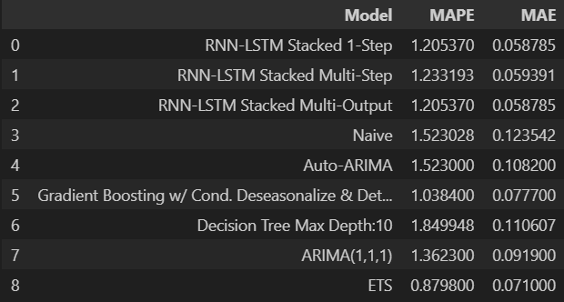

# Deep Forecasting Final Project

This project uses econometric, machine learning, and deep learning techniques such as ets, arima, decision trees, RNN, and LSTM models to predict the points scored by the San Antonio Spurs in a given game. I opted to normalize the observed scores using the opponents defensive rating in order to remove biases caused by variation in that measure. Future work could explore predicting the opponents defensive rating using the points scored as the predictor.

If you'd rather view this project on github here is the [link](https://github.com/bishopcurtisj/DATA5630_Final_Project)

## Contents

### Data

The data was primarily sourced from this kaggle dataset. [link](https://www.kaggle.com/datasets/wyattowalsh/basketball)

### src

The time-series analysis and data preprocessing are separated into the following notebooks for increased readability, as well as environment dependencies on my local system. These notebooks include:
    - data_processing.ipynb
    - econometrics_ML.ipynb
    - deep_learning.ipynb

## Results

This table compares some performance metrics of the models implemented in this project.

